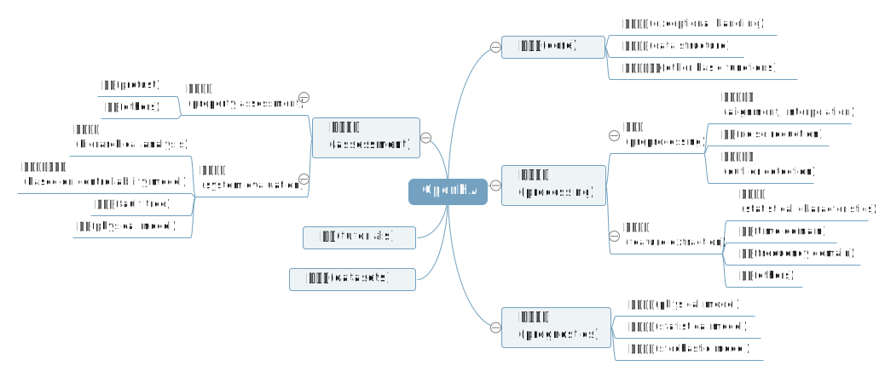

# What is the OpenHA

## Introduction to OpenHA

The OpenHA (Open Health Assessment) is an easy-to-use and open health assessment framework consisting of various tools and methods.
The framework is designed to make it easier and quicker for users to build and implement their own health assessment applications.

## Design

The OpenHA is developed according to the paper "Speculative Views on Health Assessment of Complex Systems".
This paper outlines the current research status of health assessment for complex systems.
The framework involves four main aspects: data acquisition, data processing, health assessment, and health prediction
The effective integration of various methods in these four aspects enables OpenHA to address diverse health assessment challenges posed by different scenarios and objects.
Currently, the development and maintenance is carried out by the Reliable Flight Control Research Group of Beihang University (hereinafter referred to as ["rflylab"](http://rfly.buaa.edu.cn)).

OpenHA provides developers with a range of common modules for health assessment and prediction.
Users can directly call these methods via Python scripts to accomplish various health assessment applications.
Additionally, users can develop their own custom modules.

Additionally, to reduce the barrier to entry and facilitate wider usage, we have developed a visual computing tool specifically for OpenHA.
Our hope is that this software will invite more users to join in the usage, contribution, and maintenance of OpenHA.

## Structure

The Structure of the framework is based on the design scheme summarized and organized in the aforementioned survey.
During the development and implementation phases, the specific structure of the framework is shown in the following figire.

<!-- 逐步更新迭代中，需持续修改 -->

From the above figure, it can be seen that the framework mainly includes six major modules: `core`, `processing`, `assessment`, `prognostics`, `datasets`, and `tutorials`. The specific descriptions of each module are as follows:

1. `core` - the core library, which includes definitions of some data structures, classes and methods for exception handling, and other basic methods.
2. `processing` - including two submodules: `preprocessing` and `feature`.
   1. `preprocessing` includes methods such as outlier and anomaly detection, resampling, and denoising.
   2. `feature` includes commonly used methods for various statistical features and frequency domain feature extraction.
3. `assessment` - the health assessment module, including two submodules: `attribute` and `system`, which encompass some available health assessment methods.
4. `prognostics` - the health prognostics module, which is based on statistical models or data-driven prediction methods. The model-based prediction method refers to the third-party open-source library [The NASA Prognostics Python Packages](https://nasa.github.io/progpy), or ProgPy.
5. `datasets` - including some datasets that can be used for the development and validation of health assessment algorithms.
6. `tutorials` - some demonstration tutorials related to health assessment.

## Key Properties

The properties of this framework are primarily reflected in its "flexibility" and "shareability".

- **Flexibility**

As previously mentioned, OpenHA offers various methods to solve the health assessment effectively needs for multiple scenarios and objects.
In other words, compared to "framework", OpenHA is more like a "library" or "package".
Nonetheless, it's advised that users organize their health assessment applications according to the architecture and flowchart in that paper since having a unified structure benefits inter-method comparisons and lowers the learning curve for new users.

- **Shareability**

As implied by its name, OpenHA is entirely open-source under the XXX open-source license.
As an open community, this platform hopes to attract developers who will contribute to its development, upgrading, and maintenance and encourage users to adopt it as their primary choice for building health assessment applications.
Additionally, users can contribute their health assessment methods to the platform, making it easier for others to access their research results and avoid reinventing the wheel.

On the other hand, data sharing also embodies this platform's shareability, where the RflyMAD dataset will be freely available, just like the platform itself.
Users are encouraged to contribute and share their research achievements, methods, or datasets while using OpenHA.

## How to Contribute

Our current framework uses Python language.
We recommend adhering to specific guidelines and standards during development, making it easier for other contributors to read and understand the codebase's content.
To this end, we have consulted the coding standards of other open-source software and formulated some basic development rules and guidelines.
For further details, visit our [developer documentation](../README.html) page.
