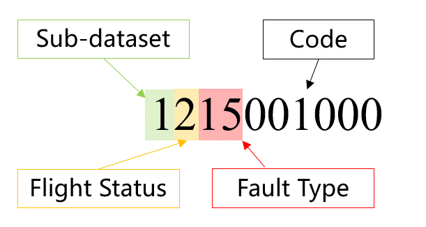

# RflyMAD: A Dataset for Multicopter Fault Detection and Health Assessment

This site presents the **RflyMAD dataset** which is used for multicopter fault detection and isolation (FDI) or health assessment (HA). The dataset is collected from RflySim platform and real flight by Beihang Reliable Flight Control Group (Rfly). There are **5629 flight cases** in total in the dataset, **2566** for software-in-the-loop (SIL) simulation, **2566** for hardware-in-the-loop (HIL) simulation and **497** for real flight. The dataset includes **11 types of common faults** under **6 flight statuses** to cover more occasions in which the multicopters have different mobility levels when faults occur.

The introduction video of the RflyMAD dataset is now available at [https://www.youtube.com/watch?v=MZby4mOPRu4](https://www.youtube.com/watch?v=MZby4mOPRu4).

UPDATES:
1. Correct SIL motor hover data in [Beihang University Yunpan](https://bhpan.buaa.edu.cn/link/AAD55429DDA43A487191D48ADA4742243D) and [Kaggle RflyMAD-SIL](https://www.kaggle.com/datasets/xianglile/rflymad-sil).
2. Now, simulation data with ROS bag is available to download ! Please see [Downloads](#31-datasets-downloads).

## 1. What is RflyMAD?
Different from research fields like computer vision, batteries, and mechanical vibration, there are relatively few publicly datasets related to the FDI, PHM and HA problems of aircraft systems. Regarding the lack of fault dataset, we form RflyMAD dataset. The RflyMAD dataset contains both simulation and real flight data, and covers sufficient fault types and flight statuses, ensuring both quantity and quality.

The hierarchy of RflyMAD dataset is shown in the following figure.


Note: In `Real Flight Data`, there are extra **wind data** about velocity and direction at the experiment time recorded in the dataset.

### 1.1 Varied Multicopters


In real flight experiments, in order to enhance the generalization of the dataset, three multicopters with different diagonal sizes are used to collect data. They are Droneyee X200 (Diagonal size of 200mm, 1.054kg), Droneyee X450 (Diagonal size of 450mm, 2.084kg) and Droneyee X680 (Diagonal size of 680mm, 4.068kg).

Note: The physical parameters of multicopter dynamic model uesd in SIL simulation and HIL simulation are achieved from Droneyee X450, including weights, moment of inertia and motor parameters.

### 1.2 Broad Fault Types
There are 11 fault types in RflyMAD dataset, including actuators, sensors of the multicopter and environmental effects. The exact cases in each fault type are listed in the following table.

| Type of Faults | SIL Simulation | HIL Simulation | Real Flight |
| -------------- | -------------- | -------------- | ----------- |
| Motor(1-4)     | 921            | 921            | 231         |
| Propeller(1-4) | 435            | 435            | $\times$    |
| Low Voltage    | 20             | 20             | $\times$    |
| Wind Affect    | 150            | 150            | $\times$    |
| Load Lose      | 150            | 150            | $\times$    |
| Sensors' Noise | 50             | 50             | 82          |
| Accelerometer  | 128            | 128            | 20          |
| Gyroscope      | 128            | 128            | 20          |
| Magnetometer   | 128            | 128            | 20          |
| Barometer      | 128            | 128            | 20          |
| GPS            | 128            | 128            | 20          |
| No Fault       | 200            | 200            | 84          |
| Total          | 2566           | 2566           | 497         |

Note: 

1. $\times$ represents this item does not exist in sub-dataset and the number means the amount of corresponding cases. 
2. `SILwithROS` and `HILwithROS` data are keep updating, so the exact number of flight cases in them are not counted temporarily.
3. Motor(1-4) represents the number of failure motors is in range of 1 to 4.

### 1.3 Sufficient Flight Statuses

The following table lists all 6 flight statuses in this dataset. 

|Flight status      |SIL Simulation|HIL Simulation|Real Flight|
|-------------------|--------------|--------------|-----------|
|Hover              |$\surd$       |$\surd$       |$\surd$    |
|Waypoints          |$\surd$       |$\surd$       |$\surd$    |
|Velocity Control   |$\surd$       |$\surd$       |$\surd$    |
|Circling           |$\surd$       |$\surd$       |$\surd$    |
|Acceleration       |$\surd$       |$\surd$       |$\surd$    |
|Deceleration       |$\surd$       |$\surd$       |$\times$   |

Note: 

1. $\surd$ represents this item exists in sub-dataset and $\times$ represents not.
2. `SILwithROS` and `HILwithROS` data are keep updating, so the exact number of flight cases in them are not counted temporarily.

### 1.4 Exact Data in One Flight Case

As shown in the figure of dataset hierarchy, each flight within the dataset contains four types of raw data and their processed files, and they could be described as follows:
- `Flight information`: It contains the flight command (e.g., take off, land and move to a target position), fault types and fault parameters.
- `ULog`: PX4 uses it to log uORB topics as messages, including device inputs (e.g., sensors, RC inputs), internal state(e.g., attitude, EKF states), and String messages.
- `Telemetry log`: TLog is recorded by the ground station, and the main content is the information sent and received between a multicopter and its corresponding QGC. Thus frequency of transmission is decided by the communication quality in real flight or the performance of the simulation computer.
- `Ground Truth Data`: This data is generated by the RflySim platform during the simulation and recorded at a frequency of 120Hz. It contains the kinematics information, fault states and motor speeds. This data is abbreviated as "GTData" in the following text.
- `BAG`: The BAG file is generated by the ROS system in each real flight. It contains the position, attitude, and control commands of the multicopter.

Note: It is worth noting that the `GTData` only exists in simulation data and the `BAG` files only in real flight data, so there are still four types of data associated with each flight.

### 1.5 Meanings of Flight Command in Flight Information
In `Flight Information`, there are flight commands, fault types and fault parameters. The exact meaning of these elements can be seen from [here](./flight_information.html). The various elements contained within the flight information are common in both simulation and real-flight data collection. These elements encompass not only flight control commands and fault information for the multicopter but also serve as labeling information within the dataset.

### 1.6 When Faults Occur in RflyMAD
In the RflyMAD dataset, each instance of data encompasses stages from takeoff to fault injection and concludes with the end of the fault, providing a comprehensive reflection of the impact of faults on the multicopter. In the dataset, for ULOG, ROSBAG and GTDData, specific message types serve as indicators of the presence of faults in each data type. Here, we will introduce them in detail.
For ULOG data, message `rfly_ctrl_lxl` contains `fault id` and `fault parameter`, which indicate whether a faut has occurred by altering the specific numerical values of signals in this message. The following figure shows when a fault occurs in one flight in ULOG.


For ROSBAG data, just like ULOG data, message `rfly_ctrl_lxl` contains `fault id` and `fault parameter`. The above figure also shows when a fault occurs in one flight in ROSBAG.
For GTData, message `fault_state`, which located in file `TrueState_data.xlsx` and `UAVState_data.xlsx`, indicates whether there is a fault or not. When a fault occurs, the value of `fault_state` turns to `1`, otherwise, it stays `0` as the following figure shows.


## 2. Citation
Our data paper is now available at [Sage Journals IJRR](https://journals.sagepub.com/doi/abs/10.1177/02783649241305153). If you are interested in our dataset, you can also read our [data paper](./rflymad_accepted.pdf) !
If you find our dataset is useful, and use our data in your research, please cite it as:
```
@article{le2023rflymad,
  title={RflyMAD: A dataset for multicopter fault detection and health assessment},
  author={Le, Xiangli and Jin, Bo and Cui, Gen and Dai, Xunhua and Quan, Quan},
  journal={The International Journal of Robotics Research},
  pages={02783649241305153},
  year={2023},
  publisher={SAGE Publications Sage UK: London, England}
}
```
## 3. Downloads
### 3.1 Datasets Downloads 
Note: The files below are restored on [Beihang University Yunpan](https://bhpan.buaa.edu.cn/link/AAD55429DDA43A487191D48ADA4742243D). If you have access to download them directly, please use this download link with a faster speed. Or if you have any problems to download the dataset from the above link, you can download them with [Kaggle](https://www.kaggle.com/datasets/xianglile/rflymad).

Raw data and their related processed files are included in each `.zip`. 

|Name          |Link    |Size   |Remark|
|--------------|--------|-------|------|
|SIL-Motor(1)  |[.zip](https://bhpan.buaa.edu.cn/link/AA4567A449B63C4F10AB7213134BA6C678)|4.33GB|SIL Simulation data, including flight statuses like hover and circling|
|SIL-Motor(2)  |[.zip](https://bhpan.buaa.edu.cn/link/AAC602DDCC27954DFC9D47CEB719908ED0)|4.06GB|SIL Simulation data, including flight statuses like waypoints, velocity, acceleration and deceleration|
|SIL-Prop      |[.zip](https://bhpan.buaa.edu.cn/link/AA309BF00E81CF44D6B109AA68434478BC)|3.60GB|SIL Simulation data, including all flight statuses with propeller fault|
|SIL-Sensors   |[.zip](https://bhpan.buaa.edu.cn/link/AA08E886A94AF14B258E11B2EB05BC8033)|5.68GB|SIL Simulation data, including all flight statuses with accelerometer, gyroscope, magnetometer, barometer and GPS fault|
|SIL-Voltage   |[.zip](https://bhpan.buaa.edu.cn/link/AA4B1B5F453D1F4CA0806AFD311ECA9677)|313MB|SIL Simulation data, low-voltage fault type|
|SIL-Wind      |[.zip](https://bhpan.buaa.edu.cn/link/AAA02C8B2951764FC485CA3321613D05BF)|4.08GB|SIL Simulation data, different wind types and strength|
|SIL-Load      |[.zip](https://bhpan.buaa.edu.cn/link/AA9FF38B83874F4774AEB6085531AAE22D)|2.31GB|SIL Simulation data, changing the weight or distribution of loads in multicopter during the flight|
|SIL-No Fault  |[.zip](https://bhpan.buaa.edu.cn/link/AA44D0E9AE064B4846BA07331FFDEE7270)|1.64GB|SIL Simulation data, including all flight statuses with no fault|
|HIL-Motor(1)  |[.zip](https://bhpan.buaa.edu.cn/link/AA35F6413533C140FC9888D993B1348598)|4.81GB|HIL Simulation data, including flight statuses like hover and circling|
|HIL-Motor(2)  |[.zip](https://bhpan.buaa.edu.cn/link/AA08BB52AF8A8E41698844B995D3ACA4CE)|4.5GB|HIL Simulation data, including flight statuses like waypoints, velocity, acceleration and deceleration|
|HIL-Prop      |[.zip](https://bhpan.buaa.edu.cn/link/AA5356D7CB0CB648989B19F53C29B4718E)|3.76GB|HIL Simulation data, including all flight statuses with propeller fault|
|HIL-Sensors   |[.zip](https://bhpan.buaa.edu.cn/link/AADDF5726E30194CB5B9196CC2F8AB6563)|5.91GB|HIL Simulation data, including all flight statuses with accelerometer, gyroscope, magnetometer, barometer and GPS fault|
|HIL-Voltage   |[.zip](https://bhpan.buaa.edu.cn/link/AAF4A5CCEBC17544459F9C68F0FB303F17)|357MB|HIL Simulation data, low-voltage fault type|
|HIL-Wind      |[.zip](https://bhpan.buaa.edu.cn/link/AAE1F5E63960144F76B6C0B32CCD58CB60)|3.89GB|HIL Simulation data, different wind types and strength|
|HIL-Load      |[.zip](https://bhpan.buaa.edu.cn/link/AA56E4F9B54D5A445BB91D01E299FC58DC)|2.62GB|HIL Simulation data, changing the weight or distribution of loads in multicopter during the flight|
|HIL-No Fault  |[.zip](https://bhpan.buaa.edu.cn/link/AA446BFA7EE0CE46599F128961013F7E71)|1.41GB|SIL Simulation data, including all flight statuses with no fault|
|Real-Motor    |[.zip](https://bhpan.buaa.edu.cn/link/AA78C66F35A01D4EA29C12BF0E17FF483A)|5.57GB|Real flight data, including three diagonal size multicopters|
|Real-Sensors  |[.zip](https://bhpan.buaa.edu.cn/link/AAEB518D137C7A433CBBFBDC5648B0CE1A)|4.01GB|Real flight data, including three diagonal size multicopters|
|Real-No Fault |[.zip](https://bhpan.buaa.edu.cn/link/AAE232A92C35A64F4BA59A68088582B46A)|973MB|Real flight data, including three diagonal size multicopters|

Apart from the above formal data in RflyMAD, we also provide a sample dataset with a smaller size for users to use and check. The processed files of the sample dataset is also given in the following link. The data processing tools used to generate processed files will be introduced in [Quick Use](#5-quick-use).
|Name          |Link    |Size   |Remark|
|--------------|--------|-------|------|
|SampleData    |[.zip](https://bhpan.buaa.edu.cn/link/AA2F44EA2844824716A87512E959952823)|340.34MB |Sample data, including 12 flight cases in each sub-dataset, so there are 36 flight cases in total.|
|ProcessData   |[.zip](https://bhpan.buaa.edu.cn/link/AA883548360DCE4E39A0F979DA9EF66791)|12.25MB |Processed data of `SampleData`, generated by data processing tools.|

Recently, we updates our simualtion tools, [RflySim](https://rflysim.com/doc/en/), and make it have the ability of simulating together with ROS, so the `ROS bag` data is also available in SIL and HIL simulation data. Thus the RflyMAD simulation data with ROS bag may provide convenience for users who are experts in Robotics community. The links are in the following, and we also put these data in [Kaggle](https://www.kaggle.com/datasets/xianglile/rflymad-withros). So if you have problems to download them from following links, you can choose to download them from [Kaggle](https://www.kaggle.com/datasets/xianglile/rflymad-withros) ! 

|Name          |Link    |Size   |Remark|
|--------------|--------|-------|------|
|SIL_Motor_ROS |[.zip](https://bhpan.buaa.edu.cn/link/AAE2A7CC372E19406F88ED67FEEB9756AC)|5.63GB |SIL Simulation data, including all flight statuses with all kinds of motor faults.|
|SIL_NoFault_ROS|[.zip](https://bhpan.buaa.edu.cn/link/AA713075956704419E8DF827D7E7FB9DDF)|1009MB | SIL Simulation data, including all flight statuses with no fault.|
|HIL_Motor_ROS |[.zip](https://bhpan.buaa.edu.cn/link/AAD802B9C2A76544B5B49A710F1601E357)|7.14GB |HIL Simulation data, including all flight statuses with all kinds of motor faults.|
|HIL_NoFault_ROS|[.zip](https://bhpan.buaa.edu.cn/link/AAFC26363D674D494BBFB3B68437297224)|1.41GB | HIL Simulation data, including all flight statuses with no fault.|


### 3.2 AutoTest Platform Downloads
If users want to collect their own simulation data (including SIL simulation and HIL simulation data), an autotest platform is provided for users to download from the following link:

BuaaAutoTestPlatform : [https://github.com/lerlis/BuaaAutoTestPlatForm](https://github.com/lerlis/BuaaAutoTestPlatForm)

With this platform, users can change the parameters of the multicopter and add their own flight statues and fault types. Detailed information could be seen from the above link.

## 4. Updates
Due to the widespread use of ROS in the robotics community and the upgrade of the simulation tools RflySim, the BAG or ROS bag data will be added to the simulation data in the subsequent data updates so that the users can have a wider range of choices. Here a detailed table about dataset updates schedule is shown in the following

|Time               |Update Contents   |Status        |
|-------------------|------------------|--------------|
|2023/11/20         |SampleData in Beihang YunPan| Uploaded|
|2023/11/24         |Whole Data in Beihang YunPan| Uploaded|
|2024/01/02         |Correct SIL Data in Beihang YunPan | Uploaded|
|2024/02/28         |Whole Data in Kaggle | Uploaded |
|2024/09/15         |SIL data with ROS bag | Uploaded |
|2024/10/15         |HIL data with ROS bag | Uploaded |
|2024/11/24         |Correct SIL Data in Beihang YunPan and Kaggle| Uploaded|
|Continuing         |New content | Preparing |

Note: At first, we uploaded the whole dataset to the [Beihang University Yunpan](https://bhpan.buaa.edu.cn/link/AAD55429DDA43A487191D48ADA4742243D). And in order to make the download process more convenient, we also uploaded the data to the [Kaggle](https://www.kaggle.com/datasets/xianglile/rflymad) platform. Besides, we keep updating the dataset with more characteristics, such as adding ROS bag data into simulation data, and correcting mistakes in the RflyMAD dataset. All of the update information will be recorded in the above table. If you have any questions, please [contact us](#8-licence).


## 5. Quick Use
After downloading the RflyMAD dataset, you'd better to reorganize the resources in the following format, just like the [hierarchy](#1-what-is-rflymad) mentioned before, in order to use our toolkit conveniently.
```
\RflyMAD dataset
    \SIL
        \acce <Flight status>
            \accelerometer <Fault type>
                ... 
                <Exact flight cases>
                ...
            \barometer
            \GPS
            \gyroscope
            \load_lose
            \low_voltage
            \magnetometer
            \motor
            \no_fault
            \propeller
            \wind_affect
        \circling
        \dece
        \hover
        \velocity
        \waypoint
    \HIL
        ... <Flight status>
    \Real
        ... <Flight status>
    \SILwithROS
        ... <Flight status>
    \HILwithROS
        ... <Flight status>
```
The detailed information about how to use our `data processing tools` to extract processed data from RflyMAD dataset is introduced in our Github repository and the download link is in the following

Data processing tools : [https://github.com/lerlis/Data_processing_tools](https://github.com/lerlis/Data_processing_tools).

Please check this site to learn more about our data processing tools in order to use our dataset quickly. After using [data processing tools](https://github.com/lerlis/Data_processing_tools), the program will generate processed data files in `--restore_path`, and the file names of the processed data files are arranged according to specific codes as shown in the figure below



The first number in the code represents the type of data, whether it is real flight data, SIL or HIL data, and the second number represents the flight status of the UAV, the third and fourth numbers represent the fault types. The last six numbers are a simple number arrangement within the same data type. And the specific meaning of the numbers on each coding position could be obtained in the following table

|Number    |Sub-dataset  |Number    |Fault Type   |
|----------|-------------|----------|-------------|
|1         | SIL         |0         |motor        |
|2         | HIL         |1         |propeller    |
|3         | Real        |2         |low voltage  |
|4         | SILwithROS  |3         |wind affect  |
|5         | HILwithROS  |4         |load lose    |
|**Number**|**Flight Status**|5     |accelerometer|
| 0        | hover       |6         |gyroscope    |
| 1        | waypoint    |7         |magnetometer |
| 2        | velocity    |8         |barometer    |
| 3        | circling    |9         |GPS          |
| 4        | acce        |10        |No fault     |
| 5        | dece        |...       |...          |

For example, if a processed data file named 'Case_3109000005.csv', it means the UAV is flying waypoints under GPS faults, and this flight case is a real flight. `000005` means it maybe the sixth flight case with the same situation during the data extraction process this time.

## 6. Samples
Here we show two examples to diagnose faults of multicopters by using data in RflyMAD. The one is data-driven method and the other one is model-based method. On the one hand, users could learn how to use RflyMAD in their research by these two examples. And on the other hand, the support relationship between the simulation and real flight data is also be verified by the transfer learning method.

### 6.1 Data-driven Method --- Transfer Learning
The detailed methods and results can be accessed from [Supplementary experiments to verify data support ability based on transfer learning](./transfer_leanring.html).

### 6.2 Model-based Method --- Kalman Filter
In this method, we use Kalman Filter to estimate the fault conditions of one flight case in RflyMAD dataset. The detailed information about how a simplified dynamic model is established for the multicopter and how to use kalman filtering method in the process of fault diagnosis while utilizing appropriate data can be found in the [Model-based Method: Kalman Filter](./model_based_KF.html).

## 7. Notes
For more information about how to use our dataset, please check other parts of our [OpenHA](https://rfly-openha.github.io/documents/) websites.

## 8. Licence
RflyMAD dataset is copyright by Reliable Flight Control Group, Beihang University. The dataset and related work are supposed to be used in non-commercial situations. If you are intended to use it for commercial purposes, please [contact us](http://rfly.buaa.edu.cn/index.html#/home) or from email: `qq_buaa@buaa.edu.cn` or `lexiangli@buaa.edu.cn`.
