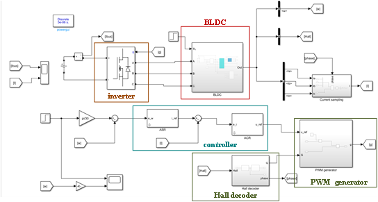

# A Dataset for Residual Life Prediction on Control Moment Gyroscope
This site presents the dataset used for Control Moment Gyroscope (CMG) Residual Life Prediction (RUL). The dataset is collected from Simulink model of a flywheel system with electrical and mechanical degradation by Beihang Automatic Test Equipment (ATE) lab. There are **3 CMGs** in the dataset, **25 cycles for OC1** and **5 cycles for OC2 and OC3**. The CMG in OC2 and OC3 works with different speed with CMG of OC1. The data is formed as `.mat`.

Contributors:
Siyuan Liang and Diyin Tang

## 1. What is our dataset?
CMGs are the essential key actuator for three-axis stabilized spacecraft in near-Earth orbit because of their well-known torque amplification property. Thus, the performance degradation, loss of functionality or unexpected failure of CMGs always influences the attitude control system a lot, even leads to an overall damage to spacecraft. Thus, PHM method for CMGs based on the data-driven method helps ensure the reliability. But the real data for CMGs is extremely rare due to unbearable high cost for sufficient reliability test. The simulation dataset can be an alternative to real CMG data.

The hierarchy of our dataset is shown in the following figure.
```
data
├── OC1
│   ├── 001.mat
│   ├── 002.mat
│   ├── ...
│   └── 025.mat
├── OC2
│   ├── 001.mat
│   ├── 002.mat
│   ├── 003.mat
│   ├── 004.mat
│   └── 005.mat
├── OC3
│   ├── 001.mat
│   ├── 002.mat
│   ├── 003.mat
│   ├── 004.mat
└── └── 005.mat
```
### 1.1 Modeling
Our model, focusing the flywheel system of CMG,  mainly consists of an inverter, a brushless DC motor(BLDC), controller, a Hall decoder and a PWM generator. The Simulink model is built as following figure.

The model of BLDC is built in detail to support the degradation for built-in parameters. And the controller is designed with back calculation for anti-windup in both speed loop and current loop. 
### 1.2 Degradation
Viscous damping coefficient $B_m$ increases to simulate the mechanical degradation and moment coefficient $K_t$ decreases to simulate the electrical degradation. We introduce Brownian Motion to parameter $B_m$ and $K_t$ with Equation:
$$B_m(t_k)=B_m(t_{k-1})+2a\Delta t+\sigma_1 Y \sqrt{\Delta t}$$
$$K_t(t_k)=K_t(t_{k-1})+b\Delta t+\sigma_2 Y \sqrt{\Delta t}$$
And the initial value of $B_m$ and $K_t$ is selected from:
$$B_m0 \sim N(0.0015,5 \times 10^{-5})$$
$$K_t0 \sim N(1.4,0.014)$$
$$Y \sim N(0,1)$$
The parameter of the Brownian Motion is set as:
|parameter|value|
|---|---|
|$a$|$6.531\times10^{-8}$|
|$b$|$-1.714\times10^{-3}$|
|$\sigma_1$|$2.5\times10^{-6}$|
|$\sigma_2$|$2\times10^{-4}$|
### 1.3 Sampling
Each cycle consists of lots of mat files. After sorting by name and concatenating, the whole cycle can be formed. All variables in each mat file is shown in following table.
|Name|Size|Meaning|
|---|---|---|
|B|1×1,double|Viscous damping coefficient, increasing over time
|i|60002×1,double|Current of the rotor
|Kt|1×1,double|moment coefficient, decreasing over time
|T|1×1,double|Torque of the flywheel system, fix to 3.2
|TL|1×1,double|Load Torque of the flywheel system, fix to 0.1
|u|60002×1,double|Voltage of the rotor
|w|60002×1,double|Rotation rate of the rotor
## 2. Downloads
The files are compressed as a `.zip` file. The size of the zip file is `71.4 GB`. Ensure you have enough space to download the dataset. The files below are restored on [Beihang University Yunpan](https://bhpan.buaa.edu.cn/link/AA83C1796E163C4EE18FF1551845D0A588). If you have access to download them directly, please use this download link with a faster speed.

|Name          |Link    |Size   |Remark|
|--------------|--------|-------|------|
| CMG Data     |[.zip](https://bhpan.buaa.edu.cn/link/AA3FB473EB5F8F4EFC9BCFBCC4B620F4EE)| 71.4 GB| Dataset collected from Simulink model of a flywheel system with electrical and mechanical degradation |


## 3. Use
It is recommended to load the file in **Matlab**. With `scipy.io.loadmat` in **Python**, the data can be loaded as well.
## 4. Licence
Our dataset is copyright by ATE lab, Beihang University. The dataset and related work are supposed to be used in non-commercial situations. If you are intended to use it for commercial purposes, please contact us or from email: tangdiyin@buaa.edu.cn.