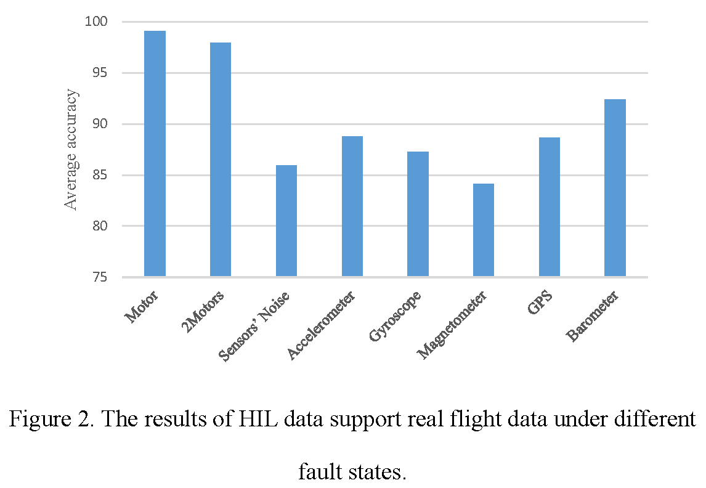

# Supplementary experiments to verify data support ability based on transfer learning

## 1.Abstract
In the real flight data set, 7 kinds of faults are involved, including motor fault, sensor noise, accelerometer fault, GPS fault, magnetometer fault, barometer fault, gyroscope fault, and 5 different flight status, including hover, waypoints, circling, acceleration, and velocity control. In our data paper, it has been verified that the SIL and HIL data of the single motor fault in hovering state have good supporting ability to the real flight data. To further verify the data set quality, different fault conditions and flight status data are tested, with analysis the support ability of simulation to real flight data and SIL data to HIL data through the method of transfer learning, so as to comprehensively verify the quality of SIL and HIL data set.

## 2.Experimental Data and Preprocessing
In the experiments, the ULog in real flight and GTData in simulation are used to diagnosis fault in the different flight status. The diagonal sizes of the simulated aircraft and the actual aircraft are both 450mm. Faults’ descriptions as shown in Table 1. Experiments 1 to 8 verify the data quality in different fault states. Experiment 1 and Experiments 9 to 12 verify the data quality in different flight status.

Selecting a set of experimental data in each flight status or fault states. One set of data contains 600 pieces of SIL data samples, 600 pieces of HIL data samples, and 600 pieces of real flight data samples. In the experiment, 400 pieces of each kind of samples respectively described as $D_{SIL}$, $D_{HIL}$ and $D_{R}$. 140 pieces of HIL data and 140 pieces of real flight data are used as two different test set $D_{TestR}$ and $D_{TestHIL}$.

Each experiment carries out 3 kinds of tests: 
a. SIL support capability test on real flight data. The test set is $D_{TestR}$, the training set is $D_{SIL}\cup10\%D_{R}$.
b. HIL support capability test on real flight data. The test set is $D_{TestR}$, the training set is $D_{HIL}\cup10\%D_{R}$.  
c. SIL support capability test on HIL. The test set is $D_{TestHIL}$, and the training set is $D_{SIL}\cup10\%D_{HIL}$.

- Table 1 Faults’ descriptions
<table>
<tr>
<th>No.</th><th>Flight status</th><th>Fault states</th><th>Training sets</th><th>Test sets</th> 
</tr>
<tr><td>1</td><td rowspan="8" style="text-align: center">Hover</td><td>One motor fault: pulling force of one motor fails from 100% to 80% from a certain moment. (The data and results are described in the paper)</td><td rowspan="12">  </td><td rowspan="12">  </td>
</tr>
<tr><td>2</td><td>Two motors fault: pulling force of two motors fail from 100% to 80% from a certain moment.</td>
</tr>
<tr><td>3</td><td>Sensor noise fault: there is noise in the barometer measurement, μ is 0 and δ is 20.</td>
</tr>
<tr><td>4</td><td>Accelerometer fault：the measured value is 5% greater than the true value.</td>
</tr>
<tr><td>5</td><td>GPS fault: X-axis data is 1.000015 times larger than the true value.</td>
</tr>
<tr><td>6</td><td>Magnetometer fault: the measured value is 5% greater than the true value.</td>
</tr>
<tr><td>7</td><td>Barometer fault: the measured value is 5% greater than the true value.</td>
</tr>
<tr><td>8</td><td>Gyroscope fault: the measured value is 10% greater than the true value.</td>
</tr>
<tr><td>9</td><td style="text-align: center">Waypoints</td><td rowspan="4">One motor fault: pulling force of one motor fails from 100% to 80% from a certain moment.</td>
</tr>
<tr><td>10</td><td style="text-align: center">Circling</td>
</tr>
<tr><td>11</td><td style="text-align: center">Acceleration</td>
</tr>
<tr><td>12</td><td style="text-align: center">Velocity Control</td>
</tr>
</table>

The data preprocessing process is consistent with Section 4.1 of our [data paper](). After preprocessing, each sample contains timestamps and 12 characteristic information such as velocity, angular velocity, acceleration, and Euler angle in three dimensions.

## 3.Model and Domain Adaptation Algorithms
The model used in the experiment is consistent with the improved LeNet-5 model described in our data paper. The domain adaptation algorithm[^1] is AdaBN[^2]. Epochs are set to 10 in different experiments, and the average prediction accuracy is calculated after multiple training. Experiments are implemented using Google’s Tensorflow toolbox[^3].

## 4.Experimental results
### 4.1 Experiments under different fault states
**(1) SIL data support real flight data test**

In the experiments, the best result of average accuracy is 98.2%, which is under single motor fault state, and the worst result of that is 82.12% under the state of magnetometer fault. The average accuracy of SIL support real flight data for 8 faults state is 89.7%.

**(2) HIL data support real flight data test**

In the experiments, the best result is also the data under the single motor fault state, the accuracy is 99.1%, and the worst is under the magnetometer fault state, that is 84.1%. The average accuracy of 8 kinds of fault states is 90.5%. Secondly, the overall level of HIL supporting real flight data is higher than that of SIL, indicating that HIL is closer to real flight data than SIL.

The fault prediction accuracy of magnetometer is lower than that of other fault states, mainly because the flight control on heading is based on the fusion sensor data strategy, and the control module automatically selects sensor data such as magnetometer and GPS to analyze the heading of UAV through calculation. As a result, magnetometer failures cannot be fully reflected by flight trajectory and attitude. If a magnetometer failure is to be fully represented, other types of data are required.

**(3) SIL data support HIL data test**

In the experiments, the experimental results under 8 fault states are all higher than 95%, and the average accuracy is 98.6%, indicating that the SIL and HIL data are close, and the SIL supports HIL well.

### 4.2 Experiments under different flight status

Through the experiments, the following conclusions can be drawn.

- In five flight status, SIL and HIL have the best supporting ability for real flight data in acceleration. In that status, motor failures are more likely to be reflected in the flight log.
- The lowest accuracy is 93.94% when test the support ability of SIL data to real flight data in circling. And the average accuracy of SIL supports real flight data is 97.9% in 5 flight status. The result of flying in circling is slightly worse than the other four flight status, because the motor failure causes the heading to change, and the heading is still constantly changing in the normal state of flying, which adds some identification errors.
- The lowest accuracy of HIL supports real flight data experiments is 97.56% under the status of waypoints. The average accuracy of HIL supports real flight data in 5 flight status is 98.9%.
- All the experimental results are higher than 97%, and the average accuracy is 99.3%, which indicates that SIL supported HIL at a high level.

## 5. Conclusion
In general, the qualities of simulation data (SIL, HIL) under different fault states and different flight status are high, and they have good supporting ability for real flight data. Simulation data can be used to replace real flight data, and HIL can be replaced by SIL in subsequent experiments and applications, thus reducing costs.

## Reference
[^1]: Zhuang F , Qi Z , Duan K ,et al.A Comprehensive Survey on Transfer Learning[J].  2019.DOI:10.48550/arXiv.1911.02685.
[^2]: Li, et al. "Adaptive Batch Normalization for practical domain adaptation." Pattern Recognition the Journal of the Pattern Recognition Society (2018).
[^3]: Martín Abadi, Ashish Agarwal, Paul Barham, Eugene Brevdo, Zhifeng Chen, Craig Citro, Greg S. Corrado, Andy Davis, Jeffrey Dean, Matthieu Devin, Sanjay Ghemawat, Ian Goodfellow, Andrew Harp, Geoffrey Irving, Michael Isard, Rafal Jozefowicz, Yangqing Jia, Lukasz Kaiser, Manjunath Kudlur, Josh Levenberg, Dan Mané, Mike Schuster, Rajat Monga, Sherry Moore, Derek Murray, Chris Olah, Jonathon Shlens, Benoit Steiner, Ilya Sutskever, Kunal Talwar, Paul Tucker, Vincent Vanhoucke, Vijay Vasudevan, Fernanda Viégas, Oriol Vinyals, Pete Warden, Martin Wattenberg, Martin Wicke, Yuan Yu, and Xiaoqiang Zheng. TensorFlow: Large-scale machine learning on heterogeneous systems, 2015. Software available from tensorflow.org.

